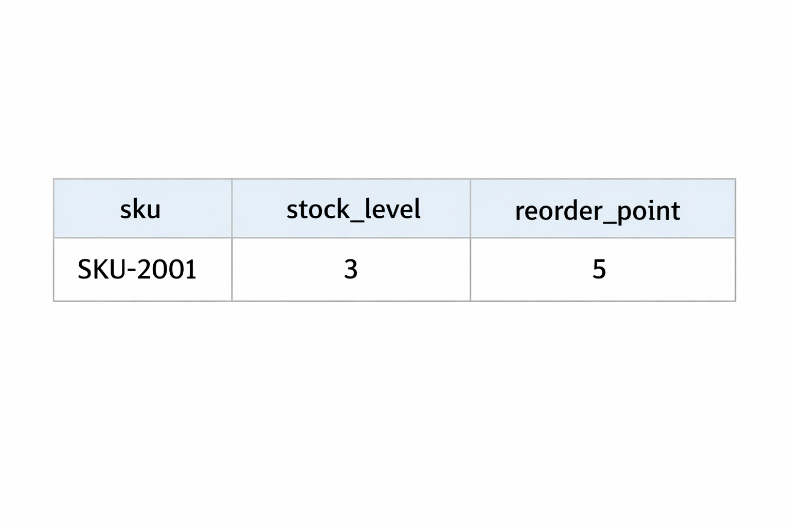
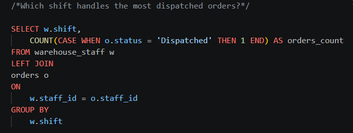
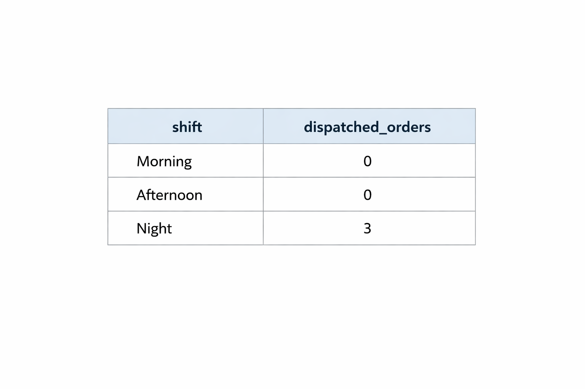
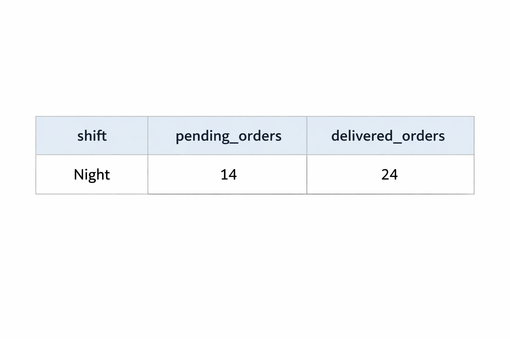
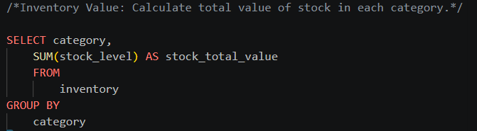
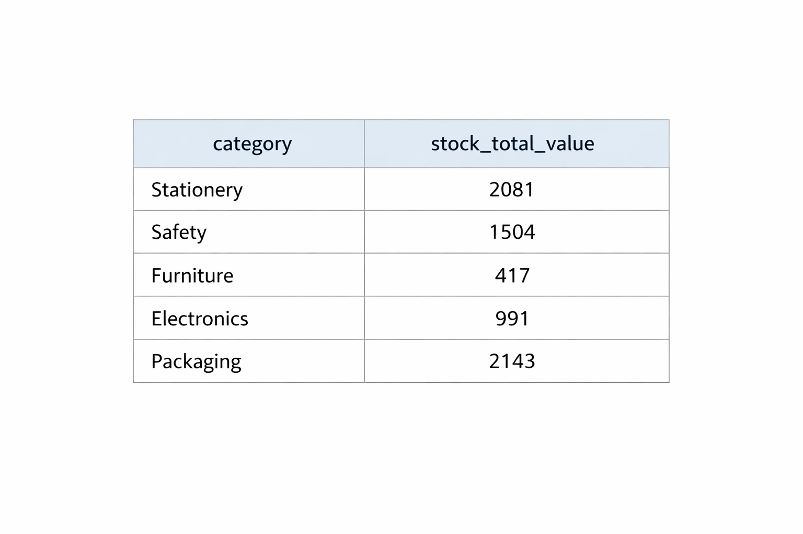
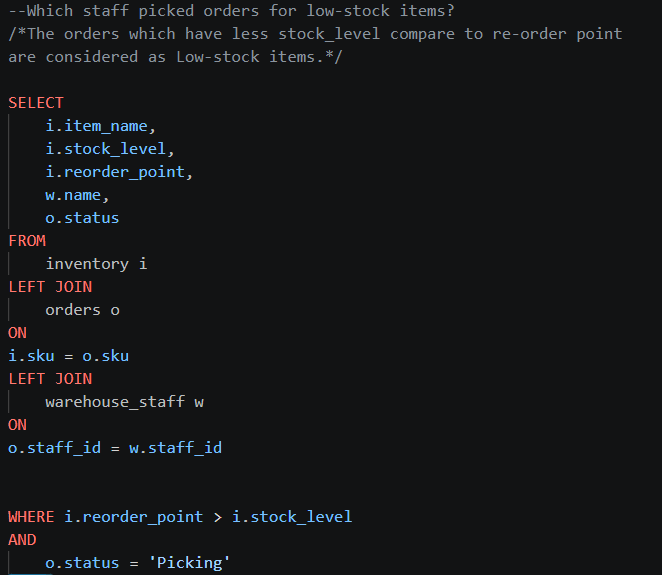
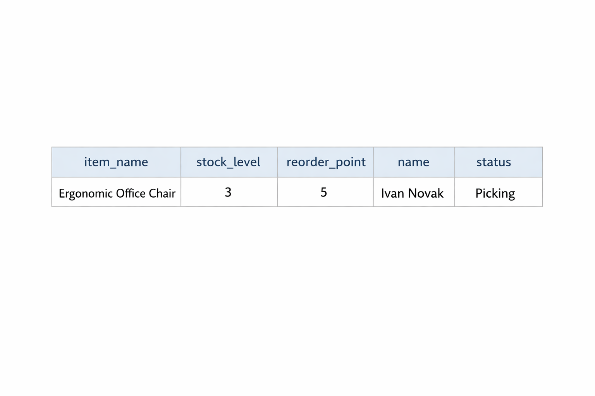

# Warehouse-Logistics-Data-Analysis

## 📊 Project Overview
This project simulates a **Warehouse Management System (WMS)** database for a logistics environment (inspired by my professional experience at DHL). It uses **PostgreSQL** to manage inventory, track orders, and monitor staff performance to identify operational bottlenecks.

As an **Information Technology Engineer**, I designed this schema to solve real-world problems like stockouts and shift inefficiencies using data-driven insights.

---

## 🛠️ Tech Stack
- **Database:** PostgreSQL
- **Tools:** pgAdmin 4, VS Code
- **Skills:** SQL (Joins, Aggregations, Group By, Subqueries)

---

## 🏗️ Database Schema
The database consists of three core tables:
1. `inventory`: Tracks product SKUs, stock levels, and reorder thresholds.
2. `orders`: Manages customer orders and fulfillment status.
3. `warehouse_staff`: Tracks personnel and their assigned shifts.

---

## 🔍 Key Data Insights & SQL Queries

Below are the analytical queries I developed to optimize warehouse operations. Each section shows the **SQL logic** followed by the **actual result** from the database.

### Low Stock Report
**Objective:** Identifies items that have fallen below their safety reorder point.

| SQL Query Logic | Query Result |
| :---: | :---: |
|  |  |

---
### Shift Performance
**Objective:** Analyzes which warehouse shift is handling the highest volume of orders.

| SQL Query Logic | Query Result |
| :---: | :---: |
|  |  |

---
### Order Fulfillment Status
**Objective:** Tracks the real-time status of pending vs. delivered orders.

| SQL Query Logic | Query Result |
| :---: | :---: |
|  |  |

---
### Inventory Value Analysis
**Objective:** Calculates the total financial value of stock held in each category.

| SQL Query Logic | Query Result |
| :---: | :---: |
|  |  |

---
### Staff Assignment for Critical Inventory
**Objective:** Identifies which warehouse staff members are currently picking orders for items that have reached critical low-stock levels (below reorder point).

| SQL Query Logic | Query Result |
| :---: | :---: |
|  |  |

---

## 🚀 How to Use
1. Clone this repository.
2. Run the `setup_database.sql` file in your PostgreSQL environment (pgAdmin).
3. Execute the analytical queries provided in the `queries/` folder to see the reports.

## 📈 Future Enhancements
- Integration with Power BI for real-time dashboarding.
- Adding a `suppliers` table to track procurement lead times.
- Implementing triggers to automatically flag low stock levels.
